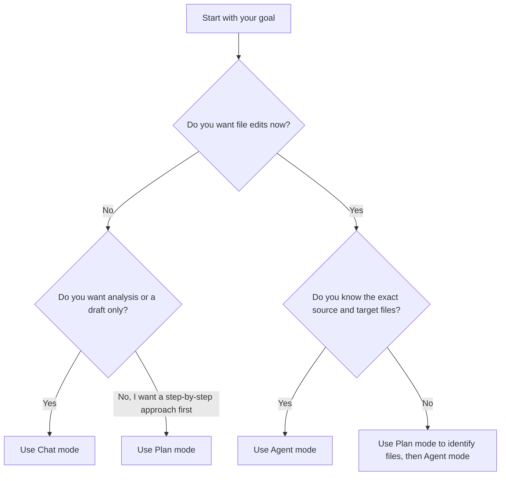
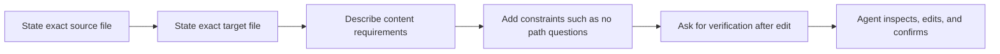
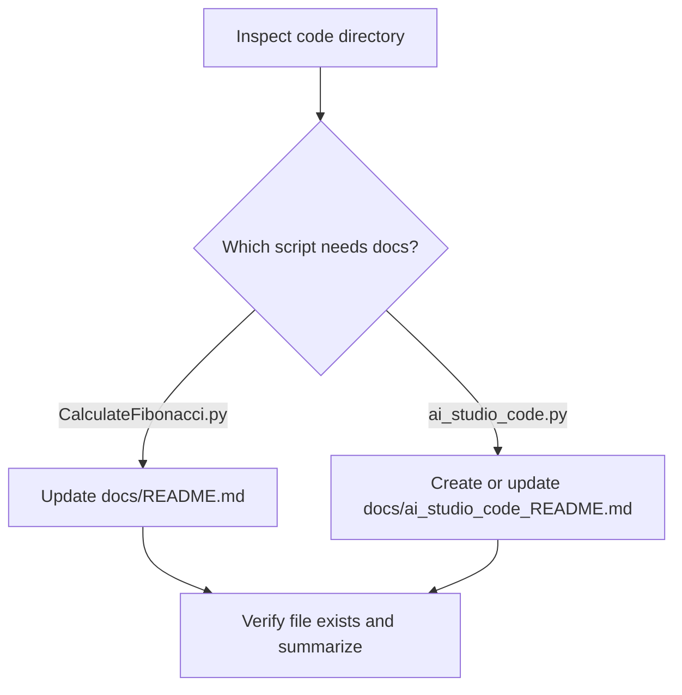

# Continue Prompt Examples

This file contains prompt examples for Chat, Plan, and Agent modes in the Continue extension, followed by prompts tailored to this repository.

## Current Continue Config Notes

Current Continue `config.yaml` files register custom `/` commands with top-level `prompts:` entries.
Older keys such as `slashCommands:` and `customCommands:` are deprecated and may be ignored.

If you want a custom command like `/test`, define it like this:

```yaml
prompts:
  - name: test
    description: Write unit tests for highlighted code
    prompt: |
      Write a comprehensive set of unit tests for the selected code. Include
      setup, correctness tests with important edge cases, and teardown. Output
      tests in chat only; don't edit any file.
```

After changing `config.yaml`, reload Continue or reload the VS Code window so the command list refreshes.

## Mode Selection Flow

Use this diagram to decide which Continue mode fits the task.



## Chat Mode Examples

Use Chat mode when you want explanation, drafting, or suggestions before making any file changes.

### Example 1

```text
Write a concise README for a Python script that calculates Fibonacci numbers.

The script:
- defines fibonacci(n)
- returns 0 for negative input
- includes example calls for 0, 1, 2, 3, 4, 5, 10, and -1

Please give me:
1. a short project description
2. a function overview
3. example usage with expected outputs
4. a final markdown version I can paste into a docs README
```

### Example 2

```text
Explain this Fibonacci script in simple language.

Focus on:
- what fibonacci(n) does
- how the loop works
- how edge cases are handled
- what should be documented in a README

Do not modify files. Just give me the explanation and a suggested README outline.
```

## Plan Mode Examples

Use Plan mode when you want Continue to inspect the repo and propose exact steps before editing anything.

### Example 1

```text
Create a plan to document the Fibonacci Python script in the docs README.

Constraints:
- source file: code/CalculateFibonacci.py
- target file: docs/README.md
- do not edit anything yet
- first inspect the script, then propose the exact README sections
- include what content should be replaced in the current README
- include a verification step to confirm the README matches the script
```

### Example 2

```text
Plan how to replace the existing docs README with documentation for the Fibonacci example.

Requirements:
- identify what the script does
- describe the fibonacci(n) function
- include negative-input behavior
- include example outputs
- keep the README short and beginner-friendly

Do not write the file yet. Give me a step-by-step plan only.
```

## Agent Mode Examples

Use Agent mode when you want Continue to carry out the task, edit files, and verify the result.

### Agent Workflow

This is the pattern that usually produces reliable Agent-mode behavior.



### Example 1

```text
Read code/CalculateFibonacci.py and update docs/README.md with a correct README for that script.

Requirements:
- do not ask me to confirm paths
- use exactly these files:
  - source: code/CalculateFibonacci.py
  - target: docs/README.md
- replace the current README contents
- describe what the script does
- explain how fibonacci(n) works
- explain that negative input returns 0
- include example usage and expected outputs
- keep the README concise and clear
- after editing, verify the target file was updated and summarize the change
```

### Example 2

```text
Create documentation for the Fibonacci script by rewriting docs/README.md.

Task rules:
- inspect code/CalculateFibonacci.py first
- do not create a new filename unless necessary
- do not ask follow-up questions about paths
- write markdown only
- include:
  - title
  - overview
  - function behavior
  - edge cases
  - sample outputs
- after the edit, verify the README exists and matches the script
```

## Reusable Template

Use this structure when you want Agent mode to act reliably:

```text
Read [source file] and update [target file].

Requirements:
- use exactly those paths
- do not ask me to confirm paths
- [specific content requirements]
- [format requirements]
- after editing, verify the file exists and summarize what changed
```

## Custom Slash Command Pattern

Use top-level `prompts:` entries to add custom `/` commands to Continue.

Example configuration:

```yaml
prompts:
  - name: explain
    description: Explain selected code clearly and briefly
    prompt: |
      Explain only the currently highlighted code in concise, plain language.
      If no highlighted code is available in the request context, say exactly: "No highlighted code was provided to /explain." and stop.
      Include:
      - what it does
      - the key inputs and outputs
      - any important edge cases
      - anything surprising or easy to miss
      Do not edit any files.

  - name: refactor
    description: Suggest a safe refactor for selected code
    prompt: |
      Refactor the selected code to improve clarity and maintainability.
      Preserve behavior unless you explicitly call out a bug.
      Keep the change minimal and explain the main improvement.
      If tests are relevant, mention what should be verified.
```

Recommended context providers for this workflow:

```yaml
context:
  - provider: currentFile
  - provider: code
  - provider: diff
  - provider: terminal
```

Example invocations:

```text
/test
```

```text
/explain
```

```text
/refactor
```

## Repo-Specific Continue Prompts

These prompts are tailored to the current workspace.

### Repo Prompt Routing



### 1. Fibonacci Script to Existing Docs README

```text
Read code/CalculateFibonacci.py and replace docs/README.md with documentation for that script.

Requirements:
- use exactly these paths:
  - source: code/CalculateFibonacci.py
  - target: docs/README.md
- do not ask me to confirm paths
- inspect the source file before writing
- explain what fibonacci(n) does
- explain how the iterative loop computes the result
- document that negative input returns 0
- include the example calls already present in the script with expected outputs
- keep the README concise and beginner-friendly
- after editing, verify docs/README.md exists and summarize the changes
```

### 2. AI Studio Script to New Markdown File

```text
Read code/ai_studio_code.py and create documentation for it at docs/ai_studio_code_README.md.

Requirements:
- use exactly these paths:
  - source: code/ai_studio_code.py
  - target: docs/ai_studio_code_README.md
- do not ask me to confirm paths
- inspect the source file first
- describe the purpose of the script
- explain the main function and the transformation applied to the input numbers
- include the example input and the printed output pattern
- keep the document short and clear
- after editing, verify docs/ai_studio_code_README.md exists and summarize the changes
```

### 3. Auto-Select the Right Script and Document It Safely

```text
Inspect the Python files in code/ and decide which script needs documentation based on the current repository contents, then create or update the appropriate markdown documentation in docs/.

Requirements:
- inspect the available Python files in code/ before deciding
- do not ask me to confirm paths unless there is a real ambiguity that cannot be resolved from the repo
- if the script is code/CalculateFibonacci.py, update docs/README.md
- if the script is code/ai_studio_code.py, create or update docs/ai_studio_code_README.md
- document the script's purpose, core function behavior, inputs, outputs, and example usage
- keep the markdown concise and accurate to the code
- after editing, verify the output file exists and summarize which script you documented and why
```