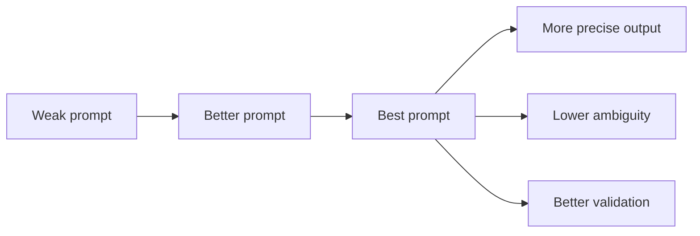
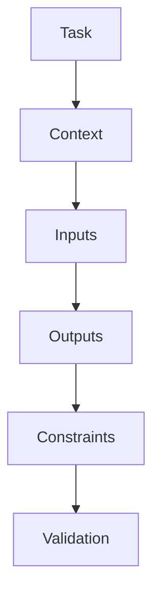
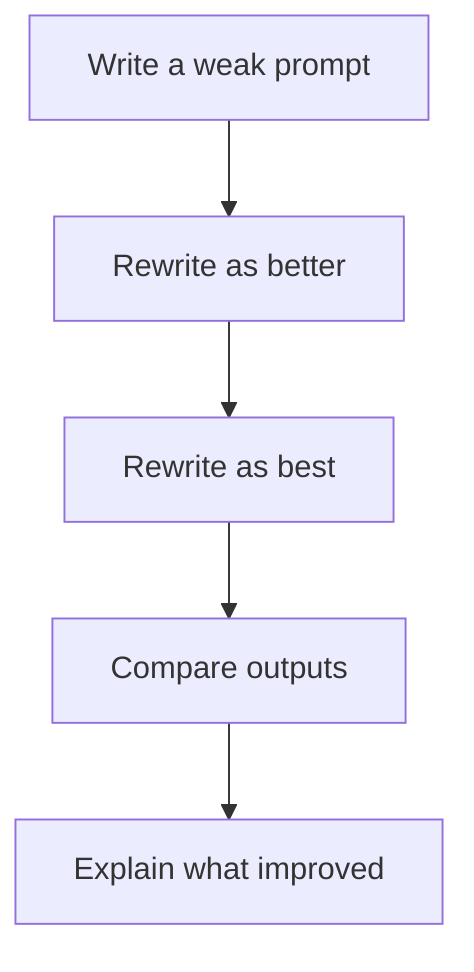

# Prompt Engineering for Vibe Coding Examples

This README collects short prompt-engineering examples that students can use to improve AI-assisted coding results.



The core pattern is simple:
- start with the task
- add scope
- specify inputs and outputs
- state constraints
- define how success will be checked

## Quick Prompt Template

Use this structure for small assignments:



```text
Task: [what to build or change]
Context: [relevant file, data, or existing pattern]
Inputs: [what comes in]
Outputs: [what should be returned, printed, or saved]
Constraints: [libraries, style, safety, architecture, performance]
Validation: [tests, checks, or expected behavior]
```

## Example 1: Prime Finder

Weak prompt:

```text
Write a function to find primes.
```

Better prompt:

```text
Write a Python function `find_primes(n)` that returns prime numbers up to `n`.
Use an efficient approach.
Handle small values correctly.
Show a few example calls.
```

Why the better prompt is better:
- names the language and function
- gives the task a clearer input and output shape
- hints at edge-case handling
- asks for quick verification examples

Best prompt:

```text
Write a Python function `find_primes(n)` that returns a list of all prime numbers up to `n`.
Use an efficient algorithm.
Handle values less than 2 by returning an empty list.
Do not include 1 as a prime.
Add 3 small example calls showing expected results.
```

Why the best prompt is best:
- removes ambiguity about return type and range behavior
- defines the exact edge case for values less than 2
- explicitly prevents a common correctness mistake
- gives the model a built-in validation target

## Example 2: CSV Trend Plot

Weak prompt:

```text
Make a chart from this CSV.
```

Better prompt:

```text
Create a Python script that reads a CSV with `date` and `sales` columns and makes a monthly sales trend chart.
Use `pandas` and `matplotlib`.
Sort the dates correctly before plotting.
Save the chart to a file.
```

Why the better prompt is better:
- identifies the expected columns
- names the tools to use
- introduces the critical date-ordering requirement
- makes the output concrete instead of vague

Best prompt:

```text
Create a Python script that reads a CSV with `date` and `sales` columns and saves a monthly sales trend line chart.
Use `pandas` and `matplotlib`.
Parse the dates correctly, sort them chronologically, and aggregate by month.
Fail with a clear message if required columns are missing.
Save the output as `monthly_sales.png`.
```

Why the best prompt is best:
- adds the missing transformation step of monthly aggregation
- defines error handling for bad inputs
- specifies the exact output filename
- gives the model a full path from raw data to finished artifact

## Example 3: Reverse Text API

Weak prompt:

```text
Build an API that reverses text.
```

Better prompt:

```text
Build a small FastAPI app with one endpoint that accepts text and returns the reversed text.
Use a request model.
Reject empty input.
Show one example request and response.
```

Why the better prompt is better:
- names the framework
- says the API should accept and return text rather than staying abstract
- adds a basic validation rule
- asks for a concrete example to inspect

Best prompt:

```text
Build a small FastAPI app with one POST endpoint that accepts JSON with a `text` field and returns the reversed string.
Use a Pydantic request model.
Reject missing or empty text values.
Keep the implementation in one file.
Also show one example request and response.
```

Why the best prompt is best:
- specifies the HTTP method explicitly
- defines the exact JSON shape
- tightens validation from empty input to missing or empty input
- constrains file structure for a cleaner teaching example

## Example 4: Ask for Tests First

Weak prompt:

```text
Build the feature.
```

Better prompt:

```text
Before implementing the feature, write tests for a function that normalizes a username.
It should trim spaces and lowercase the result.
Then write the function.
```

Why the better prompt is better:
- changes the order of work so tests come first
- defines the main behavior instead of leaving it vague
- reduces the chance of coding before thinking about expected results

Best prompt:

```text
Write the tests first for a function that normalizes a username.
The function should trim whitespace, convert to lowercase, and reject empty input.
Use `pytest`.
After listing the tests, implement the function that makes them pass.
```

Why the best prompt is best:
- specifies the exact test framework
- adds a missing invalid-input rule
- defines a tight red-green workflow
- reduces implementation ambiguity even further

## Example 5: Ask for Explanation Before Fixing

Weak prompt:

```text
Fix this error.
```

Better prompt:

```text
Explain what this error means and what is likely causing it before suggesting a fix.
Then show a small fix.
Here is the traceback: [paste traceback]
```

Why the better prompt is better:
- asks for understanding before patching
- connects the answer to the actual traceback
- pushes the model toward a smaller, more reviewable change

Best prompt:

```text
Explain why this error is happening before suggesting a fix.
Then propose the smallest code change that resolves it.
List any assumptions you are making.
Here is the traceback: [paste traceback]
```

Why the best prompt is best:
- asks for root-cause explanation, not just a generic interpretation
- emphasizes the smallest possible fix
- makes hidden assumptions visible for review
- preserves the learning value of debugging

## Example 6: Refactor Without Feature Creep

Weak prompt:

```text
Improve this code.
```

Better prompt:

```text
Refactor this function to make it easier to read.
Do not change what it does.
If you split the code, explain the new structure.
```

Why the better prompt is better:
- narrows the goal to readability rather than vague improvement
- protects behavior from accidental feature changes
- asks for justification that a reviewer can inspect

Best prompt:

```text
Refactor this function for readability and lower complexity without changing its behavior.
Do not add new features.
Keep the public API unchanged.
If you split logic into helper functions, explain why.
At the end, summarize what was simplified.
```

Why the best prompt is best:
- adds complexity reduction as a concrete goal
- explicitly locks the public API
- forbids feature creep directly
- requires a summary that makes review faster

## Classroom Advice

Students should compare prompts, not just outputs.



A useful exercise is:
- write a weak prompt
- rewrite it into a better prompt
- rewrite it again into a best prompt
- compare the generated results
- explain why each revision improved the outcome

## Related Files

- [Vibe Coding Workflow](../vibe_coding_readme.md)
- [Vibe Coding for Students](../vibe_coding_students_talk.md)
- [Vibe Coding for Educators](../vibe_coding_educators_talk.md)
- [Design Note Examples](../design_note_examples/README.md)
