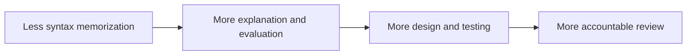
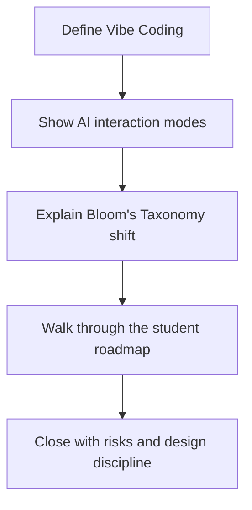
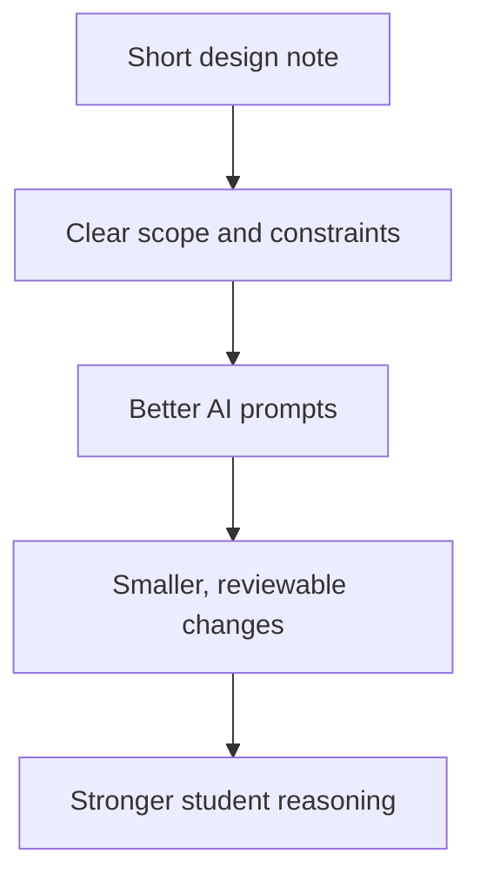

# Vibe Coding for Educators

This companion file is a presentation-friendly outline for educators who want to discuss AI-assisted coding in classrooms, labs, and curriculum design.

## Talk Goal

Help educators shift the conversation from "Should students use AI?" to "What should students learn, practice, and be assessed on when AI is available?"

## Core Message

AI does not remove the need for learning. It changes the emphasis.

- Less emphasis on memorizing syntax in isolation
- More emphasis on explanation, evaluation, design, testing, and review
- More need for structured assignments that reward reasoning over output volume

Supporting resources:
- [Prompt Engineering Examples](prompt_eng_examples/README.md)
- [Design Note Examples](design_note_examples/README.md)

## Suggested Flow

1. Define Vibe Coding as an iterative human-in-the-loop workflow.
2. Show the shift from code completion to chat, plan, and agent modes.
3. Explain Bloom's Taxonomy shift: less syntax recall, more analysis and design.
4. Walk through the junior roadmap to show how students can mature responsibly.
5. Close with risks, design discipline, and assessment implications.

## Key Teaching Points

### 1. AI Changes the Bottleneck

Students can generate code faster than they can review it. The new constraint is not typing speed. It is judgment.

### 2. Higher-Order Thinking Becomes More Visible

Ask students to explain:
- why a solution works
- what tradeoffs were chosen
- what tests prove correctness
- what risks remain unresolved

### 3. Design Documents Matter More

Require short design docs before larger AI-assisted implementations.

Example design notes students can imitate:
- [Design Note Examples](design_note_examples/README.md)
- [CSV Trend Plot](design_note_examples/csv_trend_plot_design_note.md)
- [Reverse Text API](design_note_examples/reverse_text_api_design_note.md)
- [Study Flashcards CLI](design_note_examples/study_flashcards_cli_design_note.md)

A strong design doc should clarify:
- problem definition
- scope boundaries
- data flow
- failure modes
- validation plan

### 4. Assessment Should Reward Understanding

Good assessment prompts include:
- critique this generated solution
- compare two implementations and justify one
- identify hidden risks in this AI-generated code
- write tests for this implementation before modifying it

## Classroom Recommendations

| Area | Recommendation |
| :--- | :--- |
| **Assignments** | Use tasks that require explanation, testing, and revision, not just code submission. |
| **Assessment** | Grade reasoning, validation, and design choices alongside functionality. |
| **Pair Work** | Let one student drive prompts while the other reviews assumptions and tests outputs. |
| **Code Review** | Treat AI-generated code like a junior developer submission. |
| **Projects** | Require checkpoints: prompt plan, design note, implementation, review, reflection. |

## Risks to Call Out Explicitly

- Students may confuse generation speed with mastery.
- Large AI outputs can overwhelm novice reviewers.
- Shallow review leads to technical debt and false confidence.
- Overreliance on AI can hide weak conceptual understanding.

## Closing Message

The educational goal is not to ban AI or surrender to it. The goal is to produce graduates who can direct AI well, challenge it when necessary, and take responsibility for the systems they build.
