# Vibe Coding Workflow

This document explains the iterative "Vibe Coding" loop used for rapid software development.

Companion files:
- [Educator Talk Outline](vibe_coding_educators_talk.md)
- [Student Talk Outline](vibe_coding_students_talk.md)

## Table of Contents

- [The Iterative Loop](#the-iterative-loop)
- [How It Works](#how-it-works)
- [Vibe Coding Examples](#vibe-coding-examples)
- [Evolution of AI-Assisted Coding](#evolution-of-ai-assisted-coding)
- [IDE Modes for AI-Assisted Coding](#ide-modes-for-ai-assisted-coding)
- [Bloom's Taxonomy Shift in AI Coding](#blooms-taxonomy-shift-in-ai-coding)
- [Junior Developer Learning Roadmap: AI-Assisted Coding](#junior-developer-learning-roadmap-ai-assisted-coding)
- [Mature AI-Assisted Coding: Best Practices](#mature-ai-assisted-coding-best-practices)
- [Human Limits, Review Load, and Design Discipline](#human-limits-review-load-and-design-discipline)
- [Risks & Mitigation Strategies](#risks--mitigation-strategies)
- [Expert Tips for "Vibe Coding" Mastery](#expert-tips-for-vibe-coding-mastery)

## The Iterative Loop

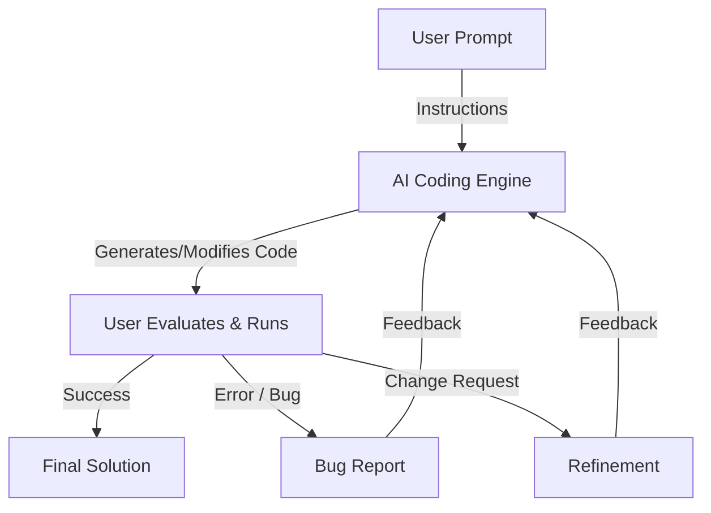

## How It Works

1.  **User Prompt**: You describe the feature, fix, or concept you want to implement in natural language.
2.  **AI Creates**: The coding engine analyzes your codebase and generates the necessary files or edits.
3.  **User Runs & Evaluates**: You execute the code in your local environment.
4.  **Feedback Loop**:
    *   If there's a **bug**, you feed the error message back to the AI.
    *   If you want a **change**, you describe the adjustment.
5.  **Iteration**: The AI updates the code based on your feedback, and the loop repeats until the "vibe" is right.

## Vibe Coding Examples

### 1. Prime Finder
**User Prompt:** "Write a Python function `find_primes(n)` that returns a list of all prime numbers up to `n` using an efficient algorithm."
*   **AI creates:** Implements the Sieve of Eratosthenes.
*   **User runs:** Realizes it includes 1 as a prime.
*   **User feedback:** "1 is not a prime number, please fix the range."
*   **AI refines:** Updates the function to start the check from 2.

### 2. CSV Analyzer
**User Prompt:** "I have a CSV with 'date' and 'sales' columns. Create a plot showing the monthly sales trend."
*   **AI creates:** Generates a script using `pandas` and `matplotlib`.
*   **User runs:** The dates are not sorted correctly in the plot.
*   **User feedback:** "The chart looks messy because the dates aren't chronological. Sort the data first."
*   **AI refines:** Adds `pd.to_datetime()` and `sort_values()` before plotting.

### 3. API Prototype
**User Prompt:** "Build a simple FastAPI endpoint that takes a string and returns it reversed."
*   **AI creates:** Scaffolds a basic FastAPI app with a GET route.
*   **User runs:** Decides it should be a POST request to handle longer strings.
*   **User feedback:** "Change the endpoint to POST and use a Pydantic model for the request body."
*   **AI refines:** Updates the route and adds the `BaseModel` schema.

## Evolution of AI-Assisted Coding

The path to "Vibe Coding" has been marked by several distinct phases of AI interaction:

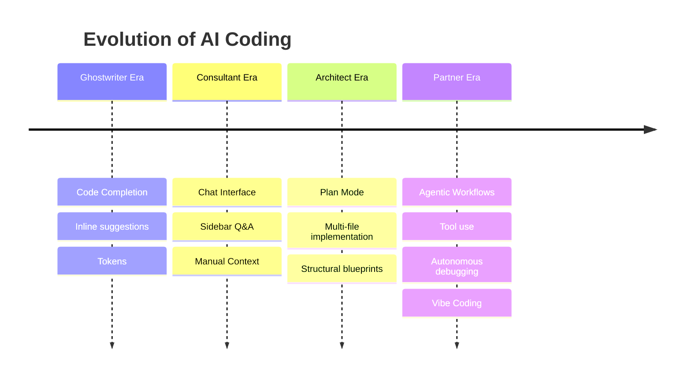

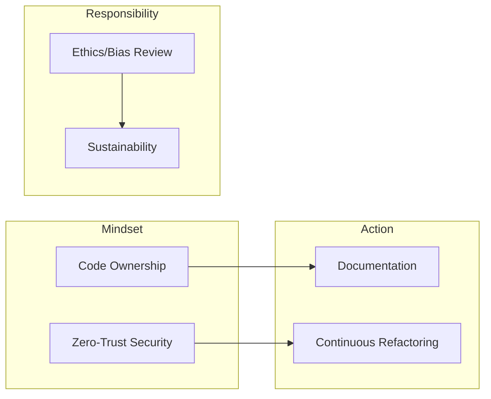

1.  **Code Completion (The "Ghostwriter" Era)**: Simple inline suggestions based on local context. AI acted as a sophisticated "Tab-to-complete" tool, predicting the next few tokens of code.
2.  **Chat Interface (The "Consultant" Era)**: Developers could ask questions and request snippets in a sidebar. This moved the AI from a mere typist to a technical advisor, though context management was manual and repetitive.
3.  **Plan Mode (The "Architect" Era)**: AI began proposing multi-file changes and high-level architecture before implementation. Developers could review a logical "blueprint" of the changes across the entire project structure.
4.  **Agentic Workflows (The "Partner" Era)**: Current state-of-the-art where AI has "agency." It can use tools, read documentation, create terminal sessions, run tests, and debug errors autonomously. The developer shifts from a "coder" to a "pilot" or "curator."

## IDE Modes for AI-Assisted Coding

Many modern IDE assistants and extensions, including tools such as Continue, expose different working modes rather than just a single chat box. The important skill is choosing the right mode for the job instead of using chat for everything.

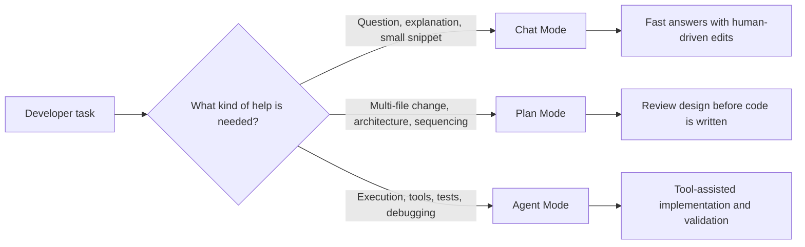

*   **Chat Mode**: Best for questions, code explanation, API examples, and tight local edits. Use it when you still want to stay in direct control of every file change.
*   **Plan Mode**: Best for larger features, refactors, migrations, or any task where sequence matters. A good plan reduces rework because you can inspect architecture, affected files, and likely risks before implementation begins.
*   **Agent Mode**: Best when the assistant can safely use tools such as search, terminal commands, tests, or documentation lookup. This mode is strongest when the task has clear boundaries and an observable way to verify success.
*   **Mode Selection Is an Engineering Decision**: If you use agent mode for an undefined problem, the assistant may wander. If you use chat mode for a large cross-cutting task, you create needless manual coordination overhead.
*   **Good Teams Switch Modes Deliberately**: A common pattern is to start in chat to clarify the goal, move to plan to agree on scope, and then use agent mode for implementation and validation.

| Task Type | Best Mode | Why |
| :--- | :--- | :--- |
| **Explain an error message** | **Chat** | Fastest path when you need interpretation, examples, or a small fix without broad repo changes. |
| **Small bug fix in one file** | **Chat** | Keeps the human close to the code and avoids unnecessary planning overhead. |
| **Design a new feature across multiple files** | **Plan** | Lets you inspect architecture, dependencies, and rollout steps before code generation starts. |
| **Refactor a messy module** | **Plan** | Refactors benefit from explicit structure, sequencing, and risk review before edits are applied. |
| **Implement a well-scoped feature with tests** | **Agent** | Strong fit when the assistant can search code, edit files, run tests, and verify behavior end to end. |
| **Investigate a failing build or test suite** | **Agent** | Tool use matters more than prose here; the assistant can inspect outputs, trace failures, and retry. |
| **Explore an unfamiliar subsystem** | **Chat** | Good for Q&A and understanding concepts before deciding whether a plan or execution workflow is needed. |
| **Large migration or framework upgrade** | **Plan** | The main risk is coordination and sequencing, so a reviewed blueprint is more valuable than immediate edits. |
| **Repeated maintenance tasks with clear checks** | **Agent** | Works well when success can be validated through commands, tests, or other observable outputs. |

| Mode Misuse | What People Do Wrong | Better Approach |
| :--- | :--- | :--- |
| **Chat as a replacement for planning** | Ask for a large, cross-cutting feature directly in chat and then manually stitch together partial answers. | Switch to **Plan** first, review the design, then implement in smaller steps. |
| **Plan without execution criteria** | Generate a high-level plan that sounds good but does not define tests, constraints, or acceptance checks. | Add explicit validation steps so the plan can guide real implementation. |
| **Agent on vague prompts** | Tell the agent to "improve the app" or "fix everything," causing drift and noisy edits. | Narrow the scope, define boundaries, and name the success signal before execution. |
| **Using one mode for every task** | Treat chat, plan, and agent as interchangeable and ignore the size or risk of the work. | Match the mode to the task: clarify in **Chat**, structure in **Plan**, execute in **Agent**. |

## Bloom's Taxonomy Shift in AI Coding

For educators and students, the biggest shift is not just faster coding. It is a shift in what humans should learn and assess.

AI-assisted coding changes where human effort should go. Less time is spent memorizing syntax or boilerplate, and more time should be invested in understanding systems, evaluating tradeoffs, and designing good solutions.

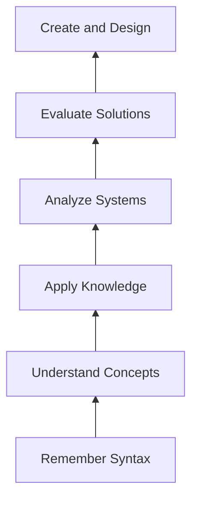

*   **Less Time on Syntax**: AI can generate scaffolding, boilerplate, and language-specific syntax quickly, reducing the educational value of rote memorization by itself.
*   **More Time on Analysis and Design**: The real differentiator becomes whether you can decompose the problem, judge tradeoffs, and steer the generated solution toward a coherent architecture.
*   **Higher-Order Thinking Matters More**: In an AI coding workflow, the strongest developers are usually not the fastest typists. They are the people who can evaluate outputs critically, reason about systems, and design constraints the model must follow.
*   **Classroom and Team Practices Should Shift Too**: Exercises should increasingly emphasize explanation, critique, architecture, testing strategy, and design documents rather than only syntax recall.

## Junior Developer Learning Roadmap: AI-Assisted Coding

Once that learning shift is clear, students can progress from basic prompting toward critical review and responsible system design.

To move from "copy-pasting" to "vibe coding mastery," follow this staged roadmap:

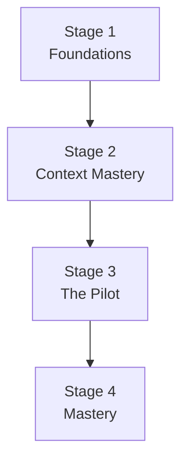

Instead of one dense roadmap graphic, break the learning path into one small overview and one chart per stage. This is easier to read in narrow Markdown previews and IDE panels.

### Stage 1: The Foundations (Understanding "How")

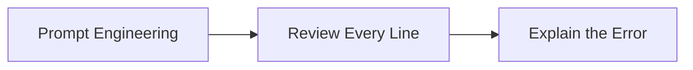

*   **Prompt Engineering**: Learn to write precise, context-rich instructions. Move beyond "write a function" to "write a stateless, pure function that handles [X] and validates [Y]."
*   **The Review Cycle**: Practice reading every line the AI generates. Look for syntax errors, logical flaws, and unused variables.
*   **Debugging with AI**: Instead of asking for a fix, feed the AI the error log and ask it to *explain why* the error happened.

### Stage 2: Context Mastery (Thinking "System-wide")

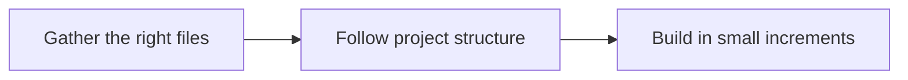

*   **Workspace Understanding**: Learn how to use feature-based search and file-reading tools to give the AI the right context. Understand that AI performance depends heavily on the files it can "see."
*   **Project Structure**: Study how your project is organized. Learn to ask AI to "follow the existing pattern in `src/utils`" to maintain consistency.
*   **Incremental Builds**: Practice breaking large features into tiny, testable iterations. Avoid the "one huge prompt" trap.

### Stage 3: The Pilot (Driving the "Agency")

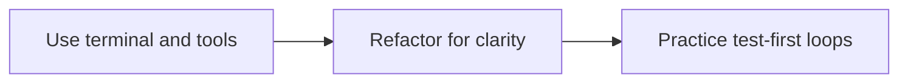

*   **Terminal & Tool Use**: Get comfortable letting the AI run commands, installs, and tests. Learn to monitor the terminal output for unexpected side effects.
*   **Refactoring Rounds**: Practice taking a working but messy piece of code and asking the AI to refactor it for readability using Clean Code principles.
*   **Test-Driven Vibe Coding**: Ask the AI to write the test file first, run it so it fails, then ask it to write the code that makes the tests pass.

### Stage 4: Mastery (Architecture & Ethics)

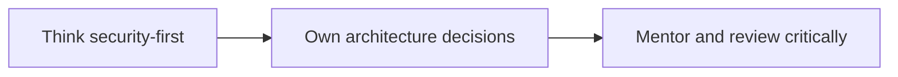

*   **Security Mindset**: Start every coding session by mentally checking for security risks. Prompt the AI specifically for secure SQL queries or sanitized inputs.
*   **Code Ownership**: Ensure you can explain every architectural decision. If the AI suggests a library you don't know, research it before accepting.
*   **Mentorship**: Teach others how to use these tools responsibly. Learn to spot hallucinations, such as the AI inventing APIs or libraries, instantly.

## Mature AI-Assisted Coding: Best Practices

After the learning model and roadmap are clear, the next step is operational discipline. Mature AI-assisted coding is not just about speed. It is about quality, safety, and maintainability.

### 1. Code Understanding & Ownership
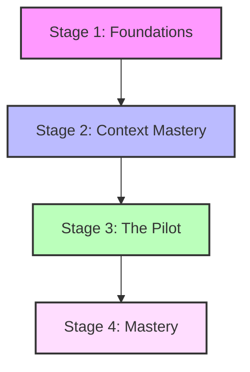

*   **The "Explain-Back" Rule**: Periodically ask the AI to explain the intuition behind a generated algorithm. If you can't explain why a certain piece of code exists, you don't own it yet.
*   **Documentation as Code**: Require the AI to generate JSDoc, docstrings, or README updates alongside the code. Accurate documentation is the bridge between AI generations and future human understanding.

### 2. Rigorous Security Reviews

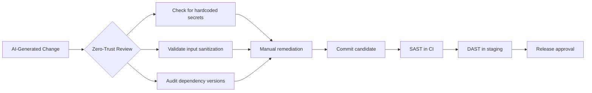

*   **Zero-Trust Generation**: Assume AI-generated code is unsafe until proven otherwise. Check specifically for hardcoded keys, improper input sanitization, and insecure dependency versions.
*   **Automated Guardrails**: Integrate CI/CD pipelines with SAST (Static Application Security Testing) and DAST (Dynamic Application Security Testing) to catch what the human eye misses during rapid iteration.

### 3. Ethical AI Principles

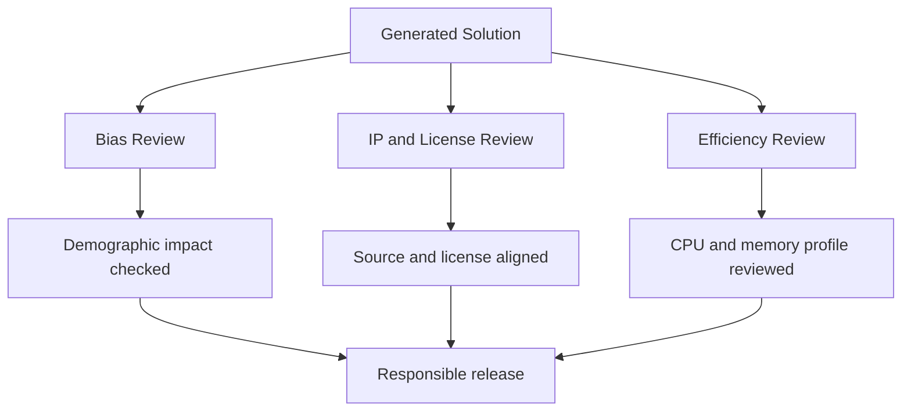

*   **Bias Awareness**: Be critical of generated code that handles demographic data, hiring algorithms, or credit scoring, as models may mirror societal biases found in their training data.
*   **Intellectual Property Compliance**: Ensure the generated code adheres to your project's license. Avoid asking AI to mimic proprietary patterns or copy-paste logic from specific copyrighted sources.
*   **Sustainability**: Optimize for efficiency. Mature coding involves asking the AI to profile this code for performance or reduce memory overhead, ensuring your application isn't just functional, but environmentally and computationally responsible.

### 4. Continuous Refactoring

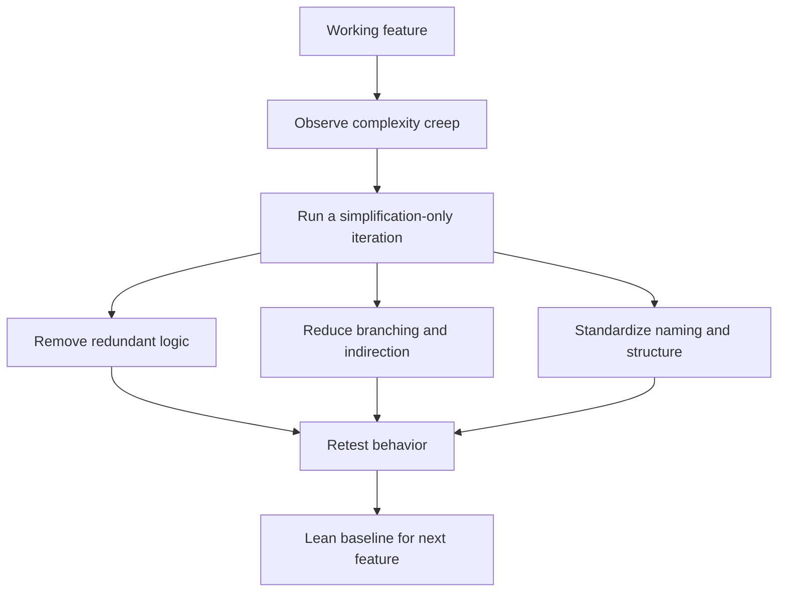

*   **Combating Entropy**: AI-assisted code can lead to rapid feature bloat. Dedicate specific iterations entirely to simplification rounds by asking the AI to reduce complexity and remove redundant logic without adding new features.

## Human Limits, Review Load, and Design Discipline

Fast generation changes the bottleneck. The hard part is often no longer writing code, but reviewing enough of it carefully enough to trust it.

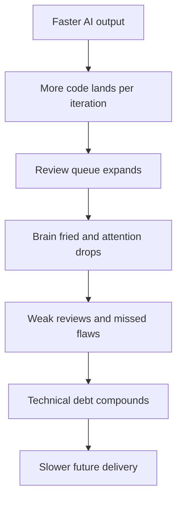

*   **Technical Debt Accelerates Quietly**: AI can produce large volumes of acceptable-looking code that still increase coupling, duplicate logic, and blur architectural boundaries. Debt grows fastest when generation speed exceeds review depth.
*   **Too Much Code to Review**: If every iteration produces hundreds of lines, human review quality falls off sharply. Treat review bandwidth as a hard engineering constraint, not an afterthought.
*   **Brain Fried Is a Real Failure Mode**: Decision fatigue leads to shallow approvals, missed edge cases, and acceptance of code that feels right but has not been reasoned through. Shorter review batches and explicit pauses are often more valuable than one more prompt.
*   **Good Design Documents Matter More, Not Less**: A concise design doc forces clarity on goals, boundaries, data flow, failure modes, and tradeoffs before the AI starts generating code. That document becomes the reference point for prompting, reviewing, and rejecting drift.

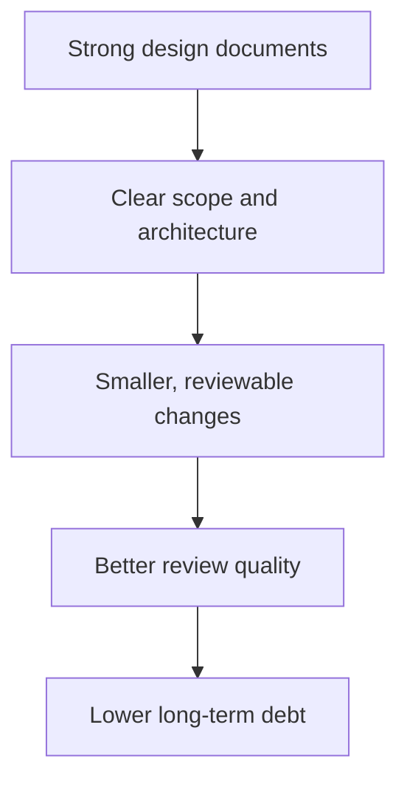

*   **Design Docs Reduce Waste**: When the architecture is written down first, you can ask the AI to implement against a stable target instead of improvising structure one prompt at a time. This reduces rework and keeps the codebase coherent.

## Risks & Mitigation Strategies

Even with strong practices, Vibe Coding carries specific risks that should be made explicit in teaching, team processes, and assessment criteria.

| Risk | Description | Mitigation Plan |
| :--- | :--- | :--- |
| **Runtime Bugs & Edge Cases** | AI may generate logic that works for happy paths but fails on boundary conditions or null inputs. | **Always test.** Implement automated unit tests and intentionally feed the AI edge case scenarios for verification. |
| **Security Vulnerabilities** | The coding engine might suggest patterns with SQL injection, insecure defaults, or hardcoded secrets. | **Security-first prompts.** Explicitly ask for secure patterns and use static analysis tools (linters/SAST) to scan AI output. |
| **Opaque Code ("Black Box")** | You might accept code that works but contains logic you don't fully understand. | **Demand explanations.** Ask the AI to comment the code or explain complex blocks. Never merge what you can't explain. |
| **Skipping Human Review** | The speed of iteration can tempt users to skip the critical read-it phase. | **Enforce a "Read-Before-Run" rule.** Treat AI code like a PR from a junior dev; verify syntax and logic before execution. |
| **Technical Debt** | Quick vibes can lead to spaghetti code, lack of modularity, or inconsistent naming conventions. | **Refactor regularly.** Periodically ask the AI to refactor for clean code principles or standardize naming once a feature is stable. |
| **Dependency Bloat** | AI might suggest adding heavy libraries for simple tasks. | **Constraint-based prompting.** Guide the AI to use standard libraries only or minimize external dependencies to keep the project lean. |

## Expert Tips for "Vibe Coding" Mastery

Close with practice-level advice. These power moves help students, educators, and teams turn the ideas above into repeatable habits.

1.  **The "Sandbox" Pattern**: When trying something high-risk or exploratory, ask the AI to create a new file such as `experiment.py` and implement the logic there first. Once it is vibe-checked, move it into your main codebase.
2.  **Context Injection**: If the AI is struggling with a specific library, search for the official documentation online, copy a relevant snippet, and paste it into your prompt as reference documentation.
3.  **The "Pseudo-Code" Bridge**: If you have a complex logic in your head that is hard to describe in plain English, write the steps in comments or pseudo-code and ask the AI to implement the logic following these steps exactly.
4.  **Linguistic Precision**: Small words matter. Terms like stateless, idempotent, and concise often produce better, safer code.
5.  **Multi-Model Verification**: If one model gets stuck in a logic loop by repeating the same mistake, try describing the issue to a different model. A fresh set of eyes can often spot the hallucination.
6.  **The "Rubber Duck" Prompt**: Sometimes, asking the AI to critique my current implementation and look for logical flaws is more valuable than asking for new code. Let it be your peer reviewer.
