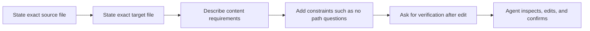

# Lab 3: Continue Agent Mode Examples

This README collects the Continue Agent mode examples from the main Continue guide and focuses them on Lab 3.

## When To Use Agent Mode

Use Agent mode when you want Continue to carry out the task, edit files, and verify the result.

Agent mode is a good fit for Lab 3 when you want to:
- inspect the Fibonacci script and update documentation for it
- point Continue at exact source and target files
- avoid back-and-forth about paths
- require a verification step after the edit

## Agent Workflow

This is the pattern that usually produces reliable Agent mode behavior.



## Agent Mode Example 1

Use this prompt when you want Continue to update documentation directly.

```text
Read CalculateFibonacci.py and update README.md with a correct README for that script.

Requirements:
- do not ask me to confirm paths
- inspect the source and complete the edit in one run
- do not stop after inspection and do not ask to continue
- use exactly these files:
  - source: CalculateFibonacci.py
  - target: README.md
- replace the current README contents
- describe what the script does
- explain how fibonacci(n) works
- explain that negative input returns 0
- include example usage and expected outputs
- keep the README concise and clear
- after editing, verify the target file was updated and summarize the change
```

## Agent Mode Example 2

Use this prompt when you want a stricter set of task rules.

```text
Create documentation for the Fibonacci script by rewriting docs/README.md.

Task rules:
- inspect CalculateFibonacci.py and complete the task in one response
- do not create a new filename unless necessary
- do not ask follow-up questions about paths
- write markdown only
- include:
  - title
  - overview
  - function behavior
  - edge cases
  - sample outputs
- after the edit, verify the README exists and matches the script
```

## Suggested Lab 3 Prompt

This version is tailored to the files in this lab.

```text
Read CalculateFibonacci.py and create or update the markdown documentation for it.

Requirements:
- use CalculateFibonacci.py as the source
- update docs/README.md as the target
- do not ask me to confirm paths
- inspect the file, perform the update, and verify the result in one run
- explain the function, base cases, loop behavior, and negative-input behavior
- include the example outputs already shown in the script
- verify the edited file after the change and summarize what was updated
```

## Reusable Template

Use this structure when you want Agent mode to act reliably:

```text
Read [source file] and update [target file].

Requirements:
- use exactly those paths
- do not ask me to confirm paths
- [specific content requirements]
- [format requirements]
- after editing, verify the file exists and summarize what changed
```

## Expected Outcome

After using Agent mode, you should have:
- an updated markdown file
- documentation that matches the source script
- a short verification summary of what changed